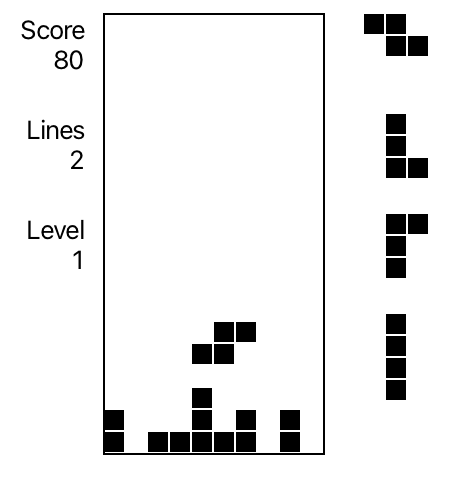

# Tetris

- Left/right to move piece
- Up to rotate right
- Z to rotate left
- A to flip
- Space to "hard drop"

This might actually be one of the greatest games ever made, depending on who you ask. So let's write it up!

Again, like I said in [Tic-Tac-Toe](/notes/tictactoe.md), if you feel up to it, it's certainly worth giving a try at writing Tetris on your own, or at least thinking through how you'd handle some of the details. (What would the game loop look like? How would you represent the board, or a piece?) If you wanted to, you could try and display the game through the console like with Tic-Tac-Toe (print the board every frame, process a key whenever the user types it and hits enter; or something better by running multiple threads/processes for displaying to the console and taking input), but I used JavaFX for doing the basic 2d graphics.

JavaFX is a general graphics library/toolkit that's one of the go-to choices for desktop Java programs. Like with a lot of Java libraries, it can be a bit verbose, but I personally think its interface is quite reasonable and it works well for our purposes. Those purposes being just creating a `Canvas` that's the size of the window and extracting a `GraphicsContext` that we use for drawing each frame. If you've used JavaScript [Canvas](https://developer.mozilla.org/en-US/docs/Web/API/Canvas_API) or something similar, `Canvas`/`GraphicsContext` has basically the same API. 

# Setting up Gradle

You could try building, linking and running all the code and JavaFX (a standalone library that doesn't come with Java) manually through the `java` and `javac` commands, which actually isn't too bad but a bit of a headache to get working the first time. Instead, I used Gradle, a common build tool (which isn't just, but mainly used for, Java) to create the project. I recommend looking up a Gradle tutorial and going through it, but for a basic project setting it up is quite straightforward: in your project directory, run `gradle init`, go through each step (a `basic` project with the defaults, except I used Groovy instead of Kotlin for the configuration file, though both are basically the same). I then added JavaFX as a dependency by adding a line to the `plugins` block and configuring it with a `javafx` block to specify a version (this part shouldn't be necessary as it should just use the latest by default, but it'd break if I didn't specify a version?) and, since it's a pretty hefty library, what modules you want: `javafx.controls` is everything I use. Then to run the project, just run `gradle run`. You can get pretty fancy with Gradle, but I've never actually bothered to properly learn it and just use it for the most basic features (compiling a bunch of Java files and linking them with some libraries). The third basic feature of Gradle however being the ability to easily write and run _unit tests_ as part of your workflow. The point of unit tests is that they enforce your "layers of abstraction" that I mentioned in Tic-Tac-Toe. Say, if you write some tests that run through a bunch of scenarios in which you might use the `Board` class in different ways, and all of those tests pass (meaning that the class did what you wanted it to do in those different cases) then you have _some_ guarentee of reliability that the abstraction can be trusted, depending on the coverage of those tests. (You might ignore a crucial edge case in coming up with your tests, for example.) Though valuable, and perhaps necessary in a large codebase, tests are painstaking, take away from development time and I am lazy, so I haven't bothered writing unit tests for any of the code in this repo. But I thought I'd mention them as something to be on your mind when learning to write projects like these.

But to ignore the above, if you want, you could also just start with my code as a template, though I recommend going through the Gradle setup process at least once. (Gradle is also what is used for FRC projects!)

# Code overview

(Again, I apologize I'm so brief with these, but read around the code! Mess with it! Look things up! There are some comments, if they're helpful.)

The most important, maybe "new", concept in this project is the _game loop_ or _tick loop_. Unlike maybe a webpage or running a calculation, a game is about running a bunch of code very frequently. There are two pieces to this: an `update` step, that updates the state of our game (moves a piece down, processes keyboard input), and of course a `draw` step, that draws the state to the screen for each frame. We bundle those together in a `tick` loop, where the "tick" represents the overall heartbeat so to speak of the game. We also break this up across our different classes—maybe breaking convention, we don't have a superclass with `draw`/`update` methods, but just define those methods where we need them and call them accordingly. This makes things a bit simpler and more explicit (a bad or early abstraction is worse than not having one) but for a larger codebase it would be good to codify a pattern like this via something like a superclass (or a component).

I'll summarize by class:
 - `App.java`: the entrypoint of our application. Holds the `public static void main()` function, which somewhat confusingly calls itself through `launch`. I don't define a `launch` function anywhere because this comes from `Application`, which is `App`'s superclass. This comes from the JavaFX docs, and is the API for how you're supposed to write a JavaFX app. All an `Application` being to a user of the library something with a `start` function that takes in a `Stage`, which is an object that represents the current JavaFX window that you can set up.
  - `Bag.java`: a basic mechanic from Tetris. Pieces aren't just sampled randomly, but are selected from a "bag" that goes through all the pieces in random orders.
  - `Board.java`: Tetris board. Handles placing pieces, clearing lines, piece collisions. Depending on how you like to think about things, maybe it'd be nicer to separate the data part (maintaining a board that you can "get"/"set" from or to) from the listed behaviors (placing a piece onto the board, checking if a piece collides with it, clearing lines when you do place a piece). Maybe a "code smell" is that "placing a piece on the board" doesn't make that much more sense to be in `Board.java` than it does in `Piece.java`.  (E.g., the better thing would be to handle all of that behavior in a "mediator" or "controller" class, either in `Game.java` or in its own class. Or perhaps you could think about how to do this in Java completely differently.) Though you have to get things done, and this works fine enough.
  - `Game.java`: Handles the high level game loop.
  - `Level.java`, `Score.java`: each are just wrappers around integers that change in certain ways in response to lines being cleared. You could do all of this in `Game.java`, but separating them is maybe nicer. (Since they are mildly more involved than just integer variables.) 
  - `Piece.java`: a piece. Doesn't keep track of position (that's handled by `Game.java`) but just stores the intrinsic properties of the piece (its size and layout, which can also be rotated).
  - `Position.java`: wraps two x/y variables.

# Things to try

- Can you try changing the size of the board? Maybe have it fit the full size of the screen, or adjust whenever you resize the window?
- Can you try adding more pieces? A 5x5 piece, or a 6x6 one?
- You might notice that the game looks a bit dull. Can you try associating a color with each piece, and invoking those colors accordingly? (Look up `ctx.setFill(Color.<color>)` and `ctx.setStroke`.)
- There's a common game mode in Tetris called 40 lines, which times how long it takes for the player to clear 40 lines. Could you try adding that as a game mode, or maybe also adding some UI for selecting either "normal" mode or 40 lines. (You can use either something like the built-in `Button`s to JavaFX, or implement your own UI on the Canvas through tracking when the mouse moves or clicks.)
- There's a beautiful game called, uh, [Bastard Tetris](https://tetris.fandom.com/wiki/Bastard_Tetris). Instead of drawing pieces from a bag, it figures out the piece that is the hardest to fit into your board and gives you that. Try thinking through how you'd implement that, and try it out. (You could also try reading the Bastet source code, or looking up the algorithm.)